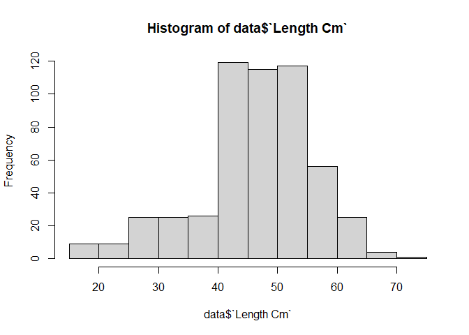
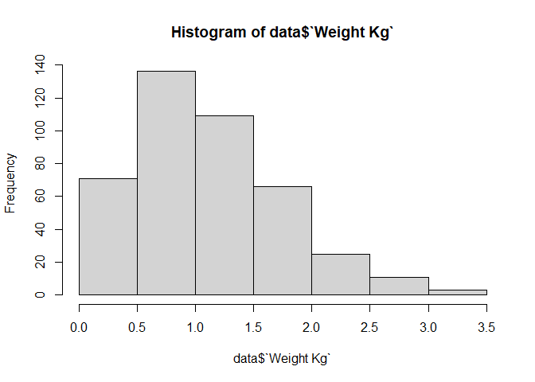
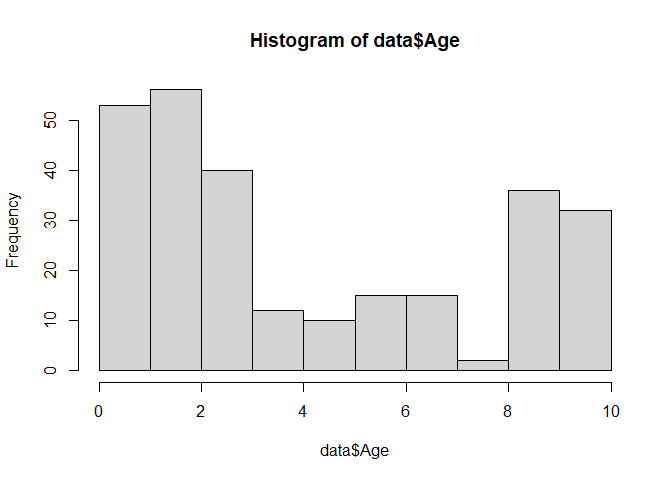
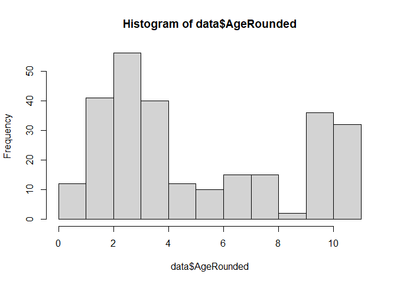
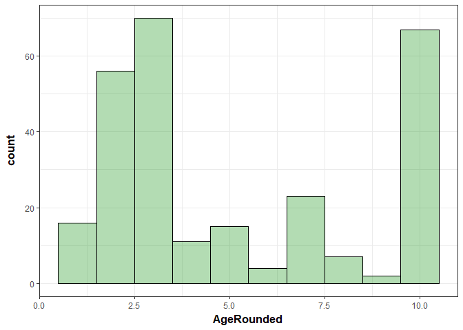
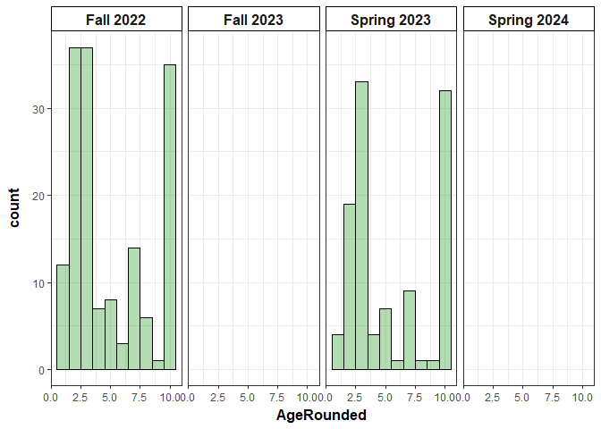
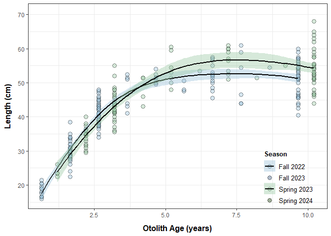
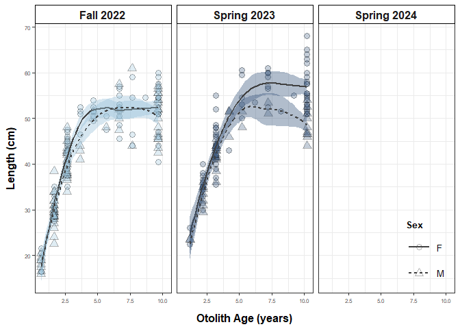
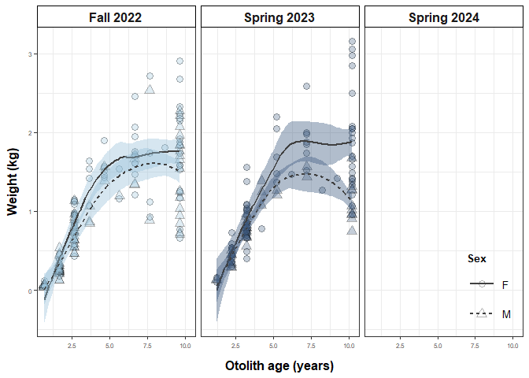
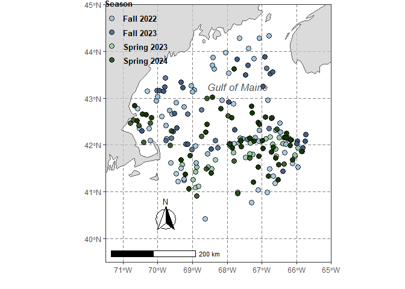

Metadata for Haddock Epigenetic Aging Project
================
Authors: Emma Strand; <emma.strand@gmgi.org>

## Load NOAA trawl survey data

Codes for the trawls we’re looking for: NOAA/NEFSC/FEMAD/ESB

22561: Spring Bottom Trawl
(<https://www.fisheries.noaa.gov/inport/item/22561>)

2 Distribution links for data:

- <https://storage.googleapis.com/nmfs_odp_nefsc/PARR/PEMAD/ESB/22561/22561_NEFSCSpringFisheriesIndependentBottomTrawlData.zip>  
- <https://storage.googleapis.com/nmfs_odp_nefsc/PARR/PEMAD/ESB/SVDBS/SVDBS_SupportTables.zip>

`UNION_FSCS_SVLen` has catch length data  
`074` is the code for Haddock  
`CRUISE6` == “202102” is an example of the correct year

Tim has done this already and are in our box folder.

## Load libraries

``` r
library(plyr) ## needs to be loaded before dplyr 
library(dplyr)
library(tidyverse)
library(ggplot2)
library(readxl) ## read excel file 
library(writexl) ## write excel file 
library(Rmisc) ## summarySE function

## for mapping
library(sf)
library(rnaturalearth)
library(rnaturalearthdata)
library("ggspatial")
```

## Load sample ID files

``` r
labwork_id <- read_xlsx("C:/BoxDrive/Box/Science/Fisheries/Projects/Epigenetic Aging/Haddock/Labwork/Haddock_labwork.xlsx") %>%
  dplyr::select(Trawl_ID, GMGI_ID)
labwork_id$Trawl_ID <- as.character(labwork_id$Trawl_ID)
```

## Load fish survey files

``` r
## skip the remaining three lines b/c they have work in the excel file that we don't need here 
## "C:\Users\EmmaStrand\MyProjects\Epigenetic_aging\data\metadata\spring2023_haddock_finclips_aged.xlsx"

spring2023 <- read_excel("data/00_metadata/Spring2023_haddock_finclips_aged.xlsx",
                         sheet = "sheet1", col_types = c(
                           "text", "text", "text", "text", "text", "date", 
                           "numeric", "numeric", "text", "text", "text", "text", 
                           "numeric", "numeric", "numeric", "text", "text", "numeric",
                           "text", "text", "numeric", "numeric", "numeric", "numeric", "skip", "skip", "skip"))
nrow(spring2023) # 112 entries 

fall2022 <- read_excel("data/00_metadata/Fall2022_haddock_finclips_aged.xlsx",
                       sheet = "sheet1", col_types = c(
                         "text", "text", "text", "text", "date", "numeric", "numeric",
                         "text", "text", "numeric", "numeric", "text", "text", "text", "numeric",
                         "numeric", "numeric", "numeric", "skip", "skip", "skip"))

nrow(fall2022) # 165 entries

fall2023 <- read_excel("data/00_metadata/Fall2023_sampling.xlsx", skip=1,
                       col_types = c("text", "text", "text", "date", "numeric", "numeric",
                                     "text", "text", "numeric"),
                       col_names = c("Cruise Id", "Operation Id", "Organism Id", "Operation Date",
                                     "Latitude Dec", "Longitude Dec", "Species Name", "INVESTIGATOR", "Length Cm")) %>%
  subset(`Species Name` == "Melanogrammus aeglefinus (haddock)")

nrow(fall2023) # 108 entries 

spring2024 <- read_excel("data/00_metadata/Spring2024_sampling.xlsx", skip=1,
                      col_types = c("text", "text", "text", "date", "numeric", "numeric",
                                     "text", "text", "numeric", "numeric", "text", "text", "text"),
                       col_names = c("Operation Id", "Stratum", "Tow", "Operation Date",
                                     "Latitude Dec", "Longitude Dec", "Species Name", "Organism Id", "Length Cm",
                                     "Weight Kg", "Ind Sex", "Maturity", "Action Name"))

nrow(spring2024) # 146 entries 
```

Join df together

``` r
## creating full dataframe from each season survey
data <- full_join(spring2023, fall2022) %>%
  full_join(., fall2023) %>% full_join(., spring2024) %>%
  
  ## creating a new column that identifies the season sampled based on the contents of the date column 
  mutate(sampling_season = case_when(
     grepl("2023-1", `Operation Date`) ~ "Fall 2023",
    grepl("2023-0",`Operation Date`) ~ "Spring 2023",
    grepl("2022-1",`Operation Date`) ~ "Fall 2022",
    grepl("2024-0", `Operation Date`) ~ "Spring 2024"
  )) %>% dplyr::rename(Trawl_ID = `Organism Id`) 
```

    ## Joining with `by = join_by(`Operation Id`, `Operation Status`, Stratum, Tow,
    ## `Operation Date`, `Latitude Dec`, `Longitude Dec`, `Species Name`, `Organism
    ## Id`, `Length Cm`, `Weight Kg`, `Ind Sex`, Maturity, `Action Name`, Age,
    ## DayDecimal, AgeDecimal, AgeRounded)`
    ## Joining with `by = join_by(`Operation Id`, `Operation Date`, `Latitude Dec`,
    ## `Longitude Dec`, `Species Name`, `Organism Id`, `Length Cm`)`
    ## Joining with `by = join_by(`Operation Id`, Stratum, Tow, `Operation Date`,
    ## `Latitude Dec`, `Longitude Dec`, `Species Name`, `Organism Id`, `Length Cm`,
    ## `Weight Kg`, `Ind Sex`, Maturity, `Action Name`)`

``` r
nrow(data)
## 531 rows (108+146+165+112 = 531)

data <- data %>% left_join(., labwork_id, by = "Trawl_ID")
## 531 rows -- safety check should be the same as nrow(data)
```

## Quality Control

**Operation metrics**

I’ll need to check with Tim to QC this..

``` r
unique(data$`Station Number`) ## NAs are from Fall 2022 - do we need these? 
unique(data$`Operation Id`)
unique(data$`Operation Status`) ## "Representative"     "Non-Representative"
unique(data$Stratum)
unique(data$Tow)
unique(data$`Operation Date`)
unique(data$`Toga Code`) ## NAs are from Fall 2022 - do we need these?
```

**Catch metadata information**

``` r
range(data$`Latitude Dec`) ## 40.42950 44.32467
range(data$`Longitude Dec`) ## -70.79038 -65.74033
unique(data$`Species Name`) ## "Melanogrammus aeglefinus (haddock)"

## checking that there are no duplicates in Organism ID
data %>% group_by(`Trawl_ID`) %>% filter(n()>1)

unique(data$`Ind Sex`) #"F" "M" NA 
unique(data$Maturity) #"Resting"    "Developing" "Spent"      "Immature"   NA           "Ripe"    "Ripe & Running"

unique(data$`Action Name`) #"Preserve Pectoral Fin Clip"
unique(data$`Parameter Name`) #"Barcode" NA  
```

**Sample Size breakdown**

Choosing samples randomly in section below per age bin. We also want to
make sure the random samples picked are stratified across length bins
too.

``` r
## 6 fish that do not have an age; they are excluded from the table below 
sample_sizes <- data %>% filter(!is.na(AgeRounded)) %>%
  dplyr::select(Trawl_ID, GMGI_ID, sampling_season, AgeRounded, `Length Cm`, `Ind Sex`) %>%
  dplyr::rename(Sex = `Ind Sex`) %>%
  mutate(across(c(AgeRounded), factor)) %>%
  mutate(Length_bins = case_when(
    `Length Cm` <= 5 ~ "0 - 5",
    `Length Cm` > 5 & `Length Cm` <= 10 ~ "5-10",
    `Length Cm` > 10 & `Length Cm` <= 15 ~ "10-15",
    `Length Cm` > 15 & `Length Cm` <= 20 ~ "15-20",
    `Length Cm` > 20 & `Length Cm` <= 25 ~ "20-25",
    `Length Cm` > 25 & `Length Cm` <= 30 ~ "25-30",
    `Length Cm` > 30 & `Length Cm` <= 35 ~ "30-35",
    `Length Cm` > 35 & `Length Cm` <= 40 ~ "35-40",
    `Length Cm` > 40 & `Length Cm` <= 45 ~ "40-45",
    `Length Cm` > 45 & `Length Cm` <= 50 ~ "45-50",
    `Length Cm` > 50 & `Length Cm` <= 55 ~ "50-55",
    `Length Cm` > 55 & `Length Cm` <= 60 ~ "55-60",
    `Length Cm` > 60 & `Length Cm` <= 65 ~ "60-65",
    `Length Cm` > 65 & `Length Cm` <= 70 ~ "65-70"
  ))

## output is sample size options 
summary_SS <- summarySE(sample_sizes, measurevar = c("Length Cm"), groupvars = c("sampling_season", "Sex", "AgeRounded"), 
                        na.rm = TRUE) %>% dplyr::select(sampling_season, Sex, AgeRounded, N) %>% arrange(., AgeRounded) 
```

    ## Warning in qt(conf.interval/2 + 0.5, datac$N - 1): NaNs produced

``` r
sample_sizes %>% 
  subset(AgeRounded == 10.2) %>% 
  #dplyr::group_by(Length_bins) %>%
  # slice_sample(., n=2)
  #sample_frac(0.36) %>%
  arrange(., `Length Cm`)

range_check <- sample_sizes %>% subset(AgeRounded == "3.65")
range(range_check$`Length Cm`)

summary_SS %>% arrange(sampling_season, AgeRounded) %>% write.csv("data/00_metadata/sample_size.csv")
```

## Decide colors

``` r
cols = c("#98C1D9", "#3D5A80", "#98c9a3", "#143601")
```

## Plot Catch Data

Age frequency

``` r
hist(data$`Length Cm`) ## 16-70.5 cm
```

<!-- -->

``` r
hist(data$`Weight Kg`, na.rm = TRUE) ## 0.040 3.155
```

<!-- -->

``` r
hist(data$Age, na.rm = TRUE) ## 0-10 
```

<!-- -->

``` r
hist(data$AgeRounded, na.rm = TRUE) ## 0.65 10.20
```

<!-- -->

``` r
agefreq <- 
  ggplot(data, aes(x=AgeRounded)) + #fill=sampling_season
  geom_histogram(color="black", binwidth = 1, fill="green4", alpha=0.3) + 
  theme_bw() + 
  #facet_grid(~sampling_season) +
  theme(panel.background=element_rect(fill='white', colour='black'),
        strip.background=element_rect(fill='white', colour='black'),
        strip.text = element_text(size = 12, face="bold"),
        legend.position="none",
        axis.title.y = element_text(margin = margin(t = 0, r = 10, b = 0, l = 0), size=12, face="bold"),
        axis.title.x = element_text(margin = margin(t = 5, r = 0, b = 0, l = 0), size=12, face="bold")); agefreq
```

<!-- -->

``` r
ggsave(agefreq, file="data/02_catch_data/Age_freq.png", width=7, height=5, units=c("in"))

seasonal_agefreq <- data %>%
  #data %>% subset(sampling_season == "Spring 2023") %>%
  ggplot(., aes(x=AgeRounded)) + #fill=sampling_season
  geom_histogram(color="black", binwidth = 1, fill="green4", alpha=0.3) + 
  theme_bw() + 
  facet_grid(~sampling_season) +
  theme(panel.background=element_rect(fill='white', colour='black'),
        strip.background=element_rect(fill='white', colour='black'),
        strip.text = element_text(size = 12, face="bold"),
        legend.position="none",
        axis.title.y = element_text(margin = margin(t = 0, r = 10, b = 0, l = 0), size=12, face="bold"),
        axis.title.x = element_text(margin = margin(t = 5, r = 0, b = 0, l = 0), size=12, face="bold")); seasonal_agefreq
```

<!-- -->

``` r
ggsave(seasonal_agefreq, file="data/02_catch_data/Age_freq_seasonal.png", width=9, height=5, units=c("in"))
```

Length vs. Age

``` r
lengthage <- data %>%
  ggplot(., aes(x=AgeRounded, y=`Length Cm`, fill=sampling_season)) + 
  theme_bw() + 
  geom_point(size=3, alpha=0.4, shape=21) +
  #facet_grid(~sampling_season) +
  xlab("Otolith Age (years)") + ylab("Length (cm)") +
  geom_smooth(color="black") +
    theme(panel.background=element_rect(fill='white', colour='black'),
        strip.background=element_rect(fill='white', colour='black'),
        strip.text = element_text(size = 12, face="bold"),
        ## legend
        legend.position=c(0.87,0.15),
          legend.text = element_text(size=10),
          legend.title = element_text(size=10, face="bold"),
          legend.background = element_blank(),
          legend.box.background = element_blank(),
          legend.key = element_rect(fill = "transparent", color = "transparent"),
        axis.title.y = element_text(margin = margin(t = 0, r = 10, b = 0, l = 0), size=12, face="bold"),
        axis.title.x = element_text(margin = margin(t = 10, r = 0, b = 0, l = 0), size=12, face="bold")) +
  scale_fill_manual(values = cols) + labs(fill="Season"); lengthage
```

    ## Warning: A numeric `legend.position` argument in `theme()` was deprecated in ggplot2
    ## 3.5.0.
    ## ℹ Please use the `legend.position.inside` argument of `theme()` instead.
    ## This warning is displayed once every 8 hours.
    ## Call `lifecycle::last_lifecycle_warnings()` to see where this warning was
    ## generated.

    ## `geom_smooth()` using method = 'loess' and formula = 'y ~ x'

    ## Warning: Removed 260 rows containing non-finite outside the scale range
    ## (`stat_smooth()`).

    ## Warning: Removed 260 rows containing missing values or values outside the scale range
    ## (`geom_point()`).

<!-- -->

``` r
ggsave(lengthage, file="data/02_catch_data/Length_v_Age.png", width=7, height=5, units=c("in"))
```

    ## `geom_smooth()` using method = 'loess' and formula = 'y ~ x'

    ## Warning: Removed 260 rows containing non-finite outside the scale range
    ## (`stat_smooth()`).
    ## Removed 260 rows containing missing values or values outside the scale range
    ## (`geom_point()`).

``` r
lengthage_sex <- data %>% filter(!is.na(`Ind Sex`)) %>%
  unite(season_sex, `Ind Sex`, sampling_season, sep = " ", remove=F) %>%
  ggplot(., aes(x=AgeRounded, y=`Length Cm`, fill=sampling_season, linetype=`Ind Sex`, shape=`Ind Sex`)) + 
  theme_bw() + 
  geom_point(size=3, alpha=0.3) +
  geom_smooth(color="grey25", alpha=0.4) +
  theme(panel.background=element_rect(fill='white', colour='black'),
        strip.background=element_rect(fill='white', colour='black'),
        ## facet wrap title text
        strip.text = element_text(size = 12, face="bold"),
        ## legend
        legend.position=c(0.93,0.15),
        legend.direction = "vertical",
          legend.text = element_text(size=10),
          legend.title = element_text(size=10, face="bold"),
          legend.background = element_blank(),
          legend.box.background = element_blank(),
          legend.key = element_rect(fill = "transparent", color = "transparent"),
          legend.key.size = unit(1, 'cm'), #change legend key size
          legend.key.height = unit(1, 'cm'), #change legend key height
          legend.key.width = unit(1, 'cm'),
        ## text size
        axis.text=element_text(size=6), 
        axis.title.y = element_text(margin = margin(t = 0, r = 10, b = 0, l = 0), size=12, face="bold"),
        axis.title.x = element_text(margin = margin(t = 10, r = 0, b = 0, l = 0), size=12, face="bold")) +
  guides(linetype=guide_legend(override.aes=list(fill=NA))) +
  facet_grid(~sampling_season) +
  xlab("Otolith Age (years)") + ylab("Length (cm)") +
  scale_fill_manual(values = cols, guide="none") +
  scale_shape_manual(values = c(21, 24)) +
  labs(linetype="Sex", shape="Sex"); lengthage_sex
```

    ## `geom_smooth()` using method = 'loess' and formula = 'y ~ x'

    ## Warning: Removed 150 rows containing non-finite outside the scale range
    ## (`stat_smooth()`).

    ## Warning: Removed 150 rows containing missing values or values outside the scale range
    ## (`geom_point()`).

<!-- -->

``` r
ggsave(lengthage_sex, file="data/02_catch_data/Length_v_Age_sex.png", width=8, height=5, units=c("in"))
```

    ## `geom_smooth()` using method = 'loess' and formula = 'y ~ x'

    ## Warning: Removed 150 rows containing non-finite outside the scale range
    ## (`stat_smooth()`).
    ## Removed 150 rows containing missing values or values outside the scale range
    ## (`geom_point()`).

Body weight v. Length

``` r
weight_length <- data %>% filter(!is.na(`Ind Sex`)) %>%
  unite(season_sex, `Ind Sex`, sampling_season, sep = " ", remove=F) %>%
  ggplot(., aes(x=`Length Cm`, y=`Weight Kg`, fill=sampling_season, linetype=`Ind Sex`, shape=`Ind Sex`)) + 
  theme_bw() + 
  geom_point(size=3, alpha=0.3) +
  geom_smooth(color="grey25", alpha=0.4) +
  theme(panel.background=element_rect(fill='white', colour='black'),
        strip.background=element_rect(fill='white', colour='black'),
        ## facet wrap title text
        strip.text = element_text(size = 12, face="bold"),
        ## legend
        legend.position=c(0.93,0.15),
        legend.direction = "vertical",
          legend.text = element_text(size=10),
          legend.title = element_text(size=10, face="bold"),
          legend.background = element_blank(),
          legend.box.background = element_blank(),
          legend.key = element_rect(fill = "transparent", color = "transparent"),
          legend.key.size = unit(1, 'cm'), #change legend key size
          legend.key.height = unit(1, 'cm'), #change legend key height
          legend.key.width = unit(1, 'cm'),
        ## text size
        axis.text=element_text(size=6), 
        axis.title.y = element_text(margin = margin(t = 0, r = 10, b = 0, l = 0), size=12, face="bold"),
        axis.title.x = element_text(margin = margin(t = 10, r = 0, b = 0, l = 0), size=12, face="bold")) +
  guides(linetype=guide_legend(override.aes=list(fill=NA))) +
  facet_grid(~sampling_season) +
  xlab("Length (cm)") + 
  ylab("Weight (kg)") +
  scale_fill_manual(values = cols, guide="none") +
  scale_shape_manual(values = c(21, 24)) +
  labs(linetype="Sex", shape="Sex"); weight_length
```

    ## `geom_smooth()` using method = 'loess' and formula = 'y ~ x'

<!-- -->

``` r
ggsave(weight_length, file="data/02_catch_data/Weight_v_Length_sex.png", width=8, height=5, units=c("in"))
```

    ## `geom_smooth()` using method = 'loess' and formula = 'y ~ x'

``` r
weight_length_age <- data %>% filter(!is.na(`Ind Sex`)) %>%
  unite(season_sex, `Ind Sex`, sampling_season, sep = " ", remove=F) %>%
  ggplot(., aes(x=AgeRounded, y=`Weight Kg`, fill=sampling_season, linetype=`Ind Sex`, shape=`Ind Sex`)) + 
  theme_bw() + 
  geom_point(size=3, alpha=0.3) +
  geom_smooth(color="grey25", alpha=0.4) +
  theme(panel.background=element_rect(fill='white', colour='black'),
        strip.background=element_rect(fill='white', colour='black'),
        ## facet wrap title text
        strip.text = element_text(size = 12, face="bold"),
        ## legend
        legend.position=c(0.93,0.15),
        legend.direction = "vertical",
          legend.text = element_text(size=10),
          legend.title = element_text(size=10, face="bold"),
          legend.background = element_blank(),
          legend.box.background = element_blank(),
          legend.key = element_rect(fill = "transparent", color = "transparent"),
          legend.key.size = unit(1, 'cm'), #change legend key size
          legend.key.height = unit(1, 'cm'), #change legend key height
          legend.key.width = unit(1, 'cm'),
        ## text size
        axis.text=element_text(size=6), 
        axis.title.y = element_text(margin = margin(t = 0, r = 10, b = 0, l = 0), size=12, face="bold"),
        axis.title.x = element_text(margin = margin(t = 10, r = 0, b = 0, l = 0), size=12, face="bold")) +
  guides(linetype=guide_legend(override.aes=list(fill=NA))) +
  facet_grid(~sampling_season) +
  xlab("Otolith age (years)") + 
  ylab("Weight (kg)") +
  scale_fill_manual(values = cols, guide="none") +
  scale_shape_manual(values = c(21, 24)) +
  labs(linetype="Sex", shape="Sex"); weight_length_age
```

    ## `geom_smooth()` using method = 'loess' and formula = 'y ~ x'

    ## Warning: Removed 150 rows containing non-finite outside the scale range
    ## (`stat_smooth()`).

    ## Warning: Removed 150 rows containing missing values or values outside the scale range
    ## (`geom_point()`).

<!-- -->

``` r
ggsave(weight_length_age, file="data/02_catch_data/Weight_v_Age_sex.png", width=8, height=5, units=c("in"))
```

    ## `geom_smooth()` using method = 'loess' and formula = 'y ~ x'

    ## Warning: Removed 150 rows containing non-finite outside the scale range
    ## (`stat_smooth()`).
    ## Removed 150 rows containing missing values or values outside the scale range
    ## (`geom_point()`).

## Export cleaned data

I didn’t edit much of this dataset. Just adding a column for the
sampling season.

``` r
data %>% write_xlsx("data/00_metadata/full_finclips_sampling.xlsx")
```

## Import sequencing sample IDs

``` r
sequencing <- read_xlsx("C:/BoxDrive/Box/Science/Fisheries/Projects/Epigenetic Aging/Haddock/Labwork/Haddock_labwork.xlsx", 
                        sheet = "Sample List") %>% dplyr::select(GMGI_ID, `Seq Rnd`) %>% left_join(., data, by = "GMGI_ID")
```

## Sample location

Finding max and min map

``` r
min(data$`Latitude Dec`); max(data$`Latitude Dec`) ## 40.4295 - 44.32467
min(data$`Longitude Dec`); max(data$`Longitude Dec`) ## -70.57933 - -65.74033

world <- ne_countries(scale = "medium", returnclass = "sf")
```

``` r
full_map <- ggplot(data = world) +
  geom_sf(fill= "grey80", alpha=0.7) +
  annotate(geom = "label", x = -67.7, y = 43.25, label = "Gulf of Maine", label.size = NA, fontface = "italic", color = "grey30", size = 4.5, fill="white") +
  geom_point(data=data, aes(x=`Longitude Dec`, y=`Latitude Dec`, fill=sampling_season), shape=21, size=2.75, alpha=0.8) +
  theme_bw() +
  annotation_scale(location = "bl", width_hint = 0.5) +
    annotation_north_arrow(location = "bl", which_north = "true",
        pad_x = unit(0.75, "in"), pad_y = unit(0.5, "in"),
        style = north_arrow_fancy_orienteering) +
  xlab("") + ylab("") +
  coord_sf(xlim = c(-71.5, -65), 
           ylim = c(45, 39.5), expand = FALSE) +
  theme(panel.grid.major = element_line(color = gray(.5), linetype = "dashed", linewidth = 0.5), 
        legend.position=c(0.135,0.89),
        legend.text = element_text(size=10, face = "bold"),
          legend.title = element_text(size=10, face="bold"),
          legend.background = element_blank(),
          legend.box.background = element_blank(),
          legend.key = element_rect(fill = "transparent", color = "transparent"),
        panel.background = element_rect(fill = "white")) + #,
        #axis.title.y = element_text(margin = margin(t = 0, r = 10, b = 0, l = 0), size=14, face="bold"),
        #axis.title.x = element_text(margin = margin(t = 10, r = 0, b = 0, l = 0), size=14, face="bold")) +
  scale_fill_manual(values = cols, name = "Season") ; full_map
```

<!-- -->

``` r
ggsave(full_map, file="data/02_catch_data/map_full.png", width=6, height=6.5, units=c("in"))

sequencing_map <- ggplot(data = world) +
  geom_sf(fill= "grey80", alpha=0.7) +
  annotate(geom = "label", x = -67.7, y = 43.25, label = "Gulf of Maine", label.size = NA, fontface = "italic", color = "grey30", size = 4.5, fill="white") +
  geom_point(data=sequencing, aes(x=`Longitude Dec`, y=`Latitude Dec`, fill=sampling_season), shape=21, size=2.75, alpha=0.8) +
  theme_bw() +
  annotation_scale(location = "bl", width_hint = 0.5) +
    annotation_north_arrow(location = "bl", which_north = "true",
        pad_x = unit(0.75, "in"), pad_y = unit(0.5, "in"),
        style = north_arrow_fancy_orienteering) +
  xlab("") + ylab("") +
  coord_sf(xlim = c(-71.5, -65), 
           ylim = c(45, 39.5), expand = FALSE) +
  theme(panel.grid.major = element_line(color = gray(.5), linetype = "dashed", linewidth = 0.5), 
        legend.position=c(0.135,0.92),
        legend.text = element_text(size=10, face = "bold"),
          legend.title = element_text(size=10, face="bold"),
          legend.background = element_blank(),
          legend.box.background = element_blank(),
          legend.key = element_rect(fill = "transparent", color = "transparent"),
        panel.background = element_rect(fill = "white")) + #,
        #axis.title.y = element_text(margin = margin(t = 0, r = 10, b = 0, l = 0), size=14, face="bold"),
        #axis.title.x = element_text(margin = margin(t = 10, r = 0, b = 0, l = 0), size=14, face="bold")) +
  scale_fill_manual(values = cols, name = "Season") ; sequencing_map
```

<!-- -->

``` r
ggsave(sequencing_map, file="data/02_catch_data/map_sequencing.png", width=6, height=6.5, units=c("in"))
```

## Length v. Age sampling bin

``` r
age_bin_example <- sequencing %>%
  ggplot(., aes(y=`Length Cm`, x=AgeRounded, fill=sampling_season)) + 
  theme_bw() + 
  geom_point(size=3, alpha=0.4, shape=21) +
  #facet_grid(~sampling_season) +
  xlab("Otolith Age (years)") + ylab("Length (cm)") +
  #geom_smooth(color="black") +
    theme(panel.background=element_rect(fill='white', colour='black'),
        strip.background=element_rect(fill='white', colour='black'),
        strip.text = element_text(size = 12, face="bold"),
        ## legend
        legend.position=c(0.87, 0.15),
          legend.text = element_text(size=10),
          legend.title = element_text(size=10, face="bold"),
          legend.background = element_blank(),
          legend.box.background = element_blank(),
          legend.key = element_rect(fill = "transparent", color = "transparent"),
        axis.title.y = element_text(margin = margin(t = 0, r = 10, b = 0, l = 0), size=12, face="bold"),
        axis.title.x = element_text(margin = margin(t = 10, r = 0, b = 0, l = 0), size=12, face="bold")) +
  scale_fill_manual(values = cols) + labs(fill="Season") 

ggsave(age_bin_example, file="data/02_catch_data/age_bin_length.png", width=7, height=5, units=c("in"))
```

## Metadata for sequencing files

Metadata file needed for methylseq pipeline. Methylseq requires you to
rename your samples to add the replicate using a \_ followed by a number
\_1 or \_REP1 or \_R1.

``` r
# file_names <- read.delim("data/metadata/file_size2.txt", header=FALSE) %>%
#   separate(V1, c("file_size", "fastq_1"), sep = " ") %>% dplyr::select(-file_size)

file_names <- read.delim("data/00_metadata/file_names_full.txt", header=FALSE) %>% dplyr::rename(fastq_1 = V1)

# keeping only first 7 characters
file_names$sample <- substr(file_names$fastq_1, 1, 7)

# keeping only rows with R1
file_names <- filter(file_names, grepl("R1", fastq_1, ignore.case = TRUE))

# duplicating column 
file_names$fastq_2 <- file_names$fastq_1

# replacing R1 with R2 in only one column 
file_names$fastq_2 <- gsub("R1", "R2", file_names$fastq_2)

# rearranging columns 
file_names <- file_names[,c(2,1,3)]

# # pasting the above column with the fastq1 and 2 columns 
# file_names$fastq_1 <- paste("/data/prj/Fisheries/epiage/haddock/raw_data/",
#                             file_names$fastq_1, sep = "")
# file_names$fastq_2 <- paste("/data/prj/Fisheries/epiage/haddock/raw_data/",
#                             file_names$fastq_2, sep = "")

file_names$fastq_1 <- paste("/work/gmgi/Fisheries/epiage/haddock/raw_data/",
                            file_names$fastq_1, sep = "")
file_names$fastq_2 <- paste("/work/gmgi/Fisheries/epiage/haddock/raw_data/",
                            file_names$fastq_2, sep = "")

## methylseq requires sample names to have _REP1 
file_names$sample <- paste(file_names$sample, "_REP1", sep="")

## exporting file to repo 
file_names %>% write.csv("data/00_metadata/samplesheet_NU_full.csv")
```
