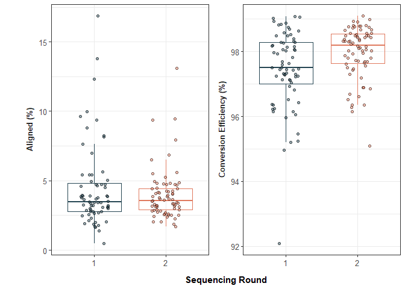
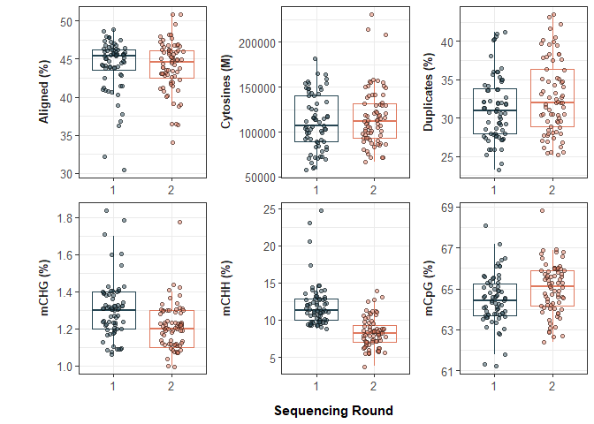

QC of WGBS and methylation pipeline
================
Authors: Emma Strand; <emma.strand@gmgi.org>

### Load libraries

``` r
library(dplyr)
```

    ## 
    ## Attaching package: 'dplyr'

    ## The following objects are masked from 'package:stats':
    ## 
    ##     filter, lag

    ## The following objects are masked from 'package:base':
    ## 
    ##     intersect, setdiff, setequal, union

``` r
library(tidyr)
library(ggplot2)
library(readxl) ## read excel file 
library(writexl) ## write excel file 
library(strex)
```

    ## Loading required package: stringr

``` r
library(ggpubr)
library(cowplot)
```

    ## 
    ## Attaching package: 'cowplot'

    ## The following object is masked from 'package:ggpubr':
    ## 
    ##     get_legend

## Read in data

Read in haddock alignment and bioinformatic processes data

``` r
WGBS_data <- read_xlsx("data/01_QC/bismark_statistics.xlsx") %>% 
  ## creating sample ID column 
  mutate(GMGI_ID = str_before_first(`Sample Name`, "_")) %>% dplyr::select(-`Sample Name`) %>%
  ## change proportions to percentages
  mutate(across(`mCpG (%)`:`Duplicates (%)`, ~ .x*100))
```

Read in results from e.coli alignment and calculating conversion
efficiency

``` r
ecoli_seq1 <- read.delim2(file = "data/03_bisulfite_conversion_efficiency/ecoli_seqrun1_align.txt", header=T) 
ecoli_seq2 <- read.delim2(file = "data/03_bisulfite_conversion_efficiency/ecoli_seqrun2_align.txt", header=T) 

ecoli <- full_join(ecoli_seq1, ecoli_seq2) %>%
  mutate(., GMGI_ID = str_before_nth(File, "_", 1),
         GMGI_ID = gsub("./", "", GMGI_ID)) %>% 
  ## calculating percent aligned to ecoli genome
  mutate(`Aligned (%)` = (Aligned.Reads/Total.Reads)*100) %>%
  ## calculating bisulfite conversion efficiency
  mutate(totalCHH = Methylated.CHHs + Unmethylated.CHHs,
         totalCHG = Methylated.chgs + Unmethylated.chgs,
         unmethCHH_CHG = Unmethylated.CHHs + Unmethylated.chgs,
         total_CHH_CHG = totalCHH + totalCHG,
         `Conversion Efficiency (%)` = (unmethCHH_CHG/total_CHH_CHG)*100) %>%
  dplyr::select(GMGI_ID, `Aligned (%)`, `Conversion Efficiency (%)`)
```

    ## Joining with `by = join_by(File, Total.Reads, Aligned.Reads, Unaligned.Reads,
    ## Ambiguously.Aligned.Reads, No.Genomic.Sequence, Duplicate.Reads..removed.,
    ## Unique.Reads..remaining., Total.Cs, Methylated.CpGs, Unmethylated.CpGs,
    ## Methylated.chgs, Unmethylated.chgs, Methylated.CHHs, Unmethylated.CHHs)`

Bring in metadata to combine with ecoli and wgbs data

``` r
metadata <- read_xlsx("data/00_metadata/full_finclips_sampling.xlsx")
labwork <- read_xlsx("C:/BoxDrive/Box/Science/Fisheries/Projects/Epigenetic Aging/Haddock/Labwork/Haddock_labwork.xlsx", sheet = "Sample List") %>% dplyr::select(GMGI_ID, `Seq Rnd`)
metadata <- full_join(metadata, labwork, by="GMGI_ID")

data <- right_join(metadata, ecoli, by="GMGI_ID") 

WGBS_data <- WGBS_data %>% left_join(., metadata, by = "GMGI_ID")
WGBS_data$`Seq Rnd` <- as.character(WGBS_data$`Seq Rnd`)

data$`Seq Rnd` <- as.character(data$`Seq Rnd`)
```

## Bisulfite Conversion

``` r
data %>% dplyr::select(GMGI_ID, `Seq Rnd`, `Aligned (%)`, `Conversion Efficiency (%)`) %>%
  gather("measurement", "value", 3:4) %>%
  
  ggplot(., aes(x=`Seq Rnd`, y=value)) +
  geom_boxplot(outlier.shape=NA, aes(color=`Seq Rnd`), fill=NA) + 
  geom_jitter(aes(fill=`Seq Rnd`), color='black', alpha=0.5, width=0.2, shape=21) +
  labs(
    y="",
    x="Sequencing Round"
  ) +
  scale_color_manual(values = c("#264653", "#e07a5f")) +
  scale_fill_manual(values = c("#264653", "#e07a5f")) +
  facet_wrap(~measurement, scales = "free",
             strip.position = "left"
             ) +
  theme_bw() +
  theme(panel.background=element_blank(),
        strip.background=element_blank(),
        strip.text = element_text(size = 10, face="bold"),
        legend.position = "none",
        strip.clip = 'off',
        strip.placement = "outside",
        axis.text.y = element_text(size=10, color="grey30"),
        axis.text.x = element_text(size=10, color="grey30"),
        axis.title.y = element_text(margin = margin(t = 0, r = 10, b = 0, l = 0), size=11, face="bold"),
        axis.title.x = element_text(margin = margin(t = 10, r = 0, b = 0, l = 0), size=11, face="bold"))
```

<!-- -->

``` r
ggsave("data/03_bisulfite_conversion_efficiency/Bisulfite_Conversion_Efficiency.png", width=6, height=4)
```

## Quality Control metrics

``` r
WGBS_data %>% dplyr::select(GMGI_ID, `Seq Rnd`, `mCpG (%)`, `mCHG (%)`, 
                            `mCHH (%)`, `Cytosines (M)`, `Aligned (%)`, `Duplicates (%)`)  %>%
  
  gather("measurement", "value", 3:8) %>%
  
  ggplot(., aes(x=`Seq Rnd`, y=value)) +
  geom_boxplot(outlier.shape=NA, aes(color=`Seq Rnd`), fill=NA) + 
  geom_jitter(aes(fill=`Seq Rnd`), color='black', alpha=0.5, width=0.2, shape=21) +
  labs(
    y="",
    x="Sequencing Round"
  ) +
  scale_color_manual(values = c("#264653", "#e07a5f")) +
  scale_fill_manual(values = c("#264653", "#e07a5f")) +
  facet_wrap(~measurement, scales = "free",
             strip.position = "left"
             ) +
  theme_bw() +
  theme(panel.background=element_blank(),
        strip.background=element_blank(),
        strip.text = element_text(size = 10, face="bold"),
        legend.position = "none",
        strip.clip = 'off',
        strip.placement = "outside",
        axis.text.y = element_text(size=10, color="grey30"),
        axis.text.x = element_text(size=10, color="grey30"),
        axis.title.y = element_text(margin = margin(t = 0, r = 10, b = 0, l = 0), size=11, face="bold"),
        axis.title.x = element_text(margin = margin(t = 10, r = 0, b = 0, l = 0), size=11, face="bold"))
```

<!-- -->

``` r
ggsave("data/01_QC/Bismark_quality_control.png", width=7, height=5)
```
